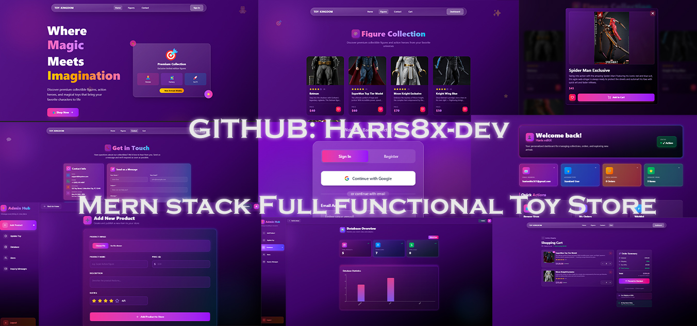

## 📸 🧸 Toy Kingdom – MERN Stack Toy Store Screenshots  

### 🏠 Web View display  
  


# 🧸 Toy Kingdom – MERN Stack Toy Store

A **full-stack e-commerce application** built with the **MERN stack + TypeScript**, featuring **secure authentication (JWT + Google One-Click Sign-In)**, **wishlist & cart management**, **checkout with billing**, and **Cloudinary integration** for image storage.

---

## 🚀 Tech Stack

### Frontend

* ⚛️ **React + TypeScript**
* 🎨 **Tailwind CSS** (responsive & modern UI)
* 🎭 **Lucide React** (icons)
* 🌐 Axios + fetch for API calls

### Backend

* 🟢 **Node.js + Express.js**
* 📦 **MongoDB + Mongoose**
* 🔑 **JWT Authentication**
* 🌍 **Google OAuth** (Google Identity Services SDK integration) (One click Google button Signin)
* ☁️ **Cloudinary** for image upload/storage

---

## ✨ Features

* 👤 **Authentication & Authorization**

  * Secure **JWT-based login/signup**
  * **Google One-Click Sign-In** using Google SDK
  * Role-based access (**Admin** & **User**)

* 🛍️ **Product Management**

  * Fetch toys/figures from MongoDB
  * Cloudinary-powered image hosting

* 💖 **Wishlist**

  * Save/remove items
  * Works for both Local and Google users

* 🛒 **Shopping Cart**

  * Add/remove products
  * Quantity increment/decrement
  * Automatic billing calculations (subtotal, tax, total)

* 💳 **Checkout**

  * Billing details form (name, email, address, card, contact)
  * Secure payment simulation
  * Cart auto-clears after successful checkout

* 📩 **Customer Messages**

  * Users can send inquiries via contact form
  * Stored in MongoDB
  * Admin can view or clear all messages

* ⚙️ **Admin Panel**

  * Manage products, messages, and settings
  * Clear all messages with confirmation modal

---

## 🛠️ Installation

Clone the repo:

```bash
git clone https://github.com/your-username/Mern-stack-Toy-store-website.git
cd Mern-stack-Toy-store-website
```

### Backend Setup

```bash
cd backend
npm install
```

Create a `.env` file:

```
MONGO_URI=your_mongo_connection
JWT_SECRET=your_jwt_secret
CLOUDINARY_CLOUD_NAME=your_cloud_name
CLOUDINARY_API_KEY=your_api_key
CLOUDINARY_API_SECRET=your_api_secret
GOOGLE_CLIENT_ID=your_google_client_id
```

Run backend:

```bash
npm run start
```

### Frontend Setup

```bash
cd frontend
npm install
npm run dev
```

---
## 👨‍💻 Author

Developed by **Haris** 🚀
